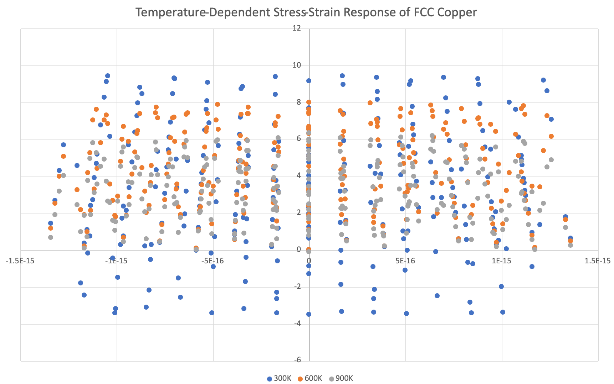

# Multi-Scale Materials Informatics Pipeline for Copper Tensile Deformation

This repository contains a fully automated computational framework designed to simulate, analyze, and predict the mechanical failure of an FCC Copper crystal lattice under varying thermal extremes.

## Technical Framework
* **Molecular Dynamics Engine:** LAMMPS (utilizing NPT ensembles and a 1 fs timestep)
* **Interatomic Potential:** NIST-validated Mishin EAM Copper Potential (`Cu01.eam.alloy`)
* **Visual Analytics:** OVITO (Dislocation Extraction Algorithm [DXA] & Virial Stress Mapping)
* **Data Processing:** Excel Automated Feature Extraction

## Project Workflow & Methodology
1. **Simulation Execution:** Applied a uniform tensile deformation rate of 10^9 s^-1 along the Z-axis of a pristine FCC Copper lattice.
2. **Parametric Thermal Sweep:** Conducted identical mechanical loading profiles across a strictly controlled temperature gradient: **300K (Ambient)**, **600K (Intermediate)**, and **900K (Extreme)**.
3. **Atomic Defect Tracking:** Implemented a Dislocation Extraction Algorithm (DXA) in OVITO to strip away structurally perfect FCC atoms, successfully isolating Shockley partial dislocations and tracking stacking fault trends.
4. **Macroscopic Engineering Graphs:** Extracted automated text dumps to plot smooth True Stress vs. Engineering Strain curves, highlighting the onset of structural yield limits.

## Key Insights & Scientific Conclusions
* **Thermal Softening Verifications:** The quantitative data proves a stark reduction in maximum yield strength as the environment shifts from 300K to 900K.
* **Mechanism Identification:** Visually verified that elevated thermal energy acts as a direct kinetic catalyst, drastically lowering the energy barrier required for dislocation nucleation and forcing the crystal lattice to fail at significantly lower structural loads.

## Visual & Quantitative Analytics

### Microscopic Defect Evolution (OVITO Parametric Thermal Sweep)

#### 300K — Ambient Temperature (High Lattice Stability)
.jpg)

#### 600K — Intermediate Temperature (Early Defect Nucleation)
.jpg)

#### 900K — Extreme Temperature (Rapid Structural Breakdown)
.jpg)

### Macroscopic Stress-Strain Relationship (Excel Master Graph)

